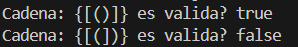
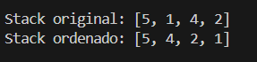
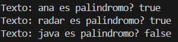

# Practica de ejercicios estructuras lineales

## Estudiante: Xavier Fajardo 
# Ejercicio 01: Validación de Signos
Implementar un algoritmo en Java que determine si un String que contiene únicamente los caracteres:

( ) { } [ ]
es válido, considerando que:

Todo símbolo de apertura debe cerrarse.
Los símbolos deben cerrarse en el orden correcto.
Cada símbolo de cierre debe corresponder al tipo correcto de apertura.
Descripción del problema
Dado un String, se debe verificar si la secuencia de signos está correctamente balanceada.

Ejemplos

- Input:  "([]){}"

- Output: true

- Input:  "({)}"
- Output: false
# Descripcion de la Solucion 
Se utiliza un Stack:

Los símbolos de apertura se almacenan en el stack.

Cuando aparece un símbolo de cierre, se compara con el último símbolo agregado.

Si no coincide o el stack está vacío, la cadena es inválida.

Al final, si el stack queda vacío, la cadena es válida.

### Captura del problema 1

# Ejercicio 02: Ordenar un Stack
Implementar un algoritmo que ordene un Stack de manera que los elementos más pequeños queden en el tope del Stack.

Restricciones
Solo se permite el uso de Stacks adicionales
No está permitido copiar los elementos a arreglos, listas u otras estructuras
El ordenamiento debe realizarse únicamente usando operaciones propias del Stack (push, pop, peek, isEmpty)
Descripción del problema
Dado un Stack de enteros, se debe reordenar su contenido usando otro Stack auxiliar, respetando las reglas de esta estructura de datos.

Ejemplo
- Input:  (tope) 5 -> 1 -> 4 -> 2
- Output: (tope) 1 -> 2 -> 4 -> 5

Consideraciones
- El Stack original debe quedar ordenado al finalizar el proceso
- El elemento más pequeño debe quedar siempre en el tope
- La solución debe evidenciar razonamiento lógico y dominio del Stack

## Descripcion de la Solucion 
Se crea un stack auxiliar.

Se extrae un elemento del stack original.

Mientras el tope del stack auxiliar sea mayor, se devuelve al stack original.

El elemento se inserta en la posición correcta.

Al finalizar, los elementos se regresan al stack original ya ordenados.

### Captura del problema 2

# Ejercicio 03: Palíndromo usando Colas

Idea principal

El método recibe un String

Internamente se usan dos colas

No se compara directamente el String

Se aprovecha el comportamiento FIFO de las colas

Lógica del algoritmo

Recibir el String

Insertar cada carácter en una cola original

Insertar los mismos caracteres en una segunda cola invertida

Para invertir se usa una cola auxiliar

Comparar elemento por elemento ambas colas

Si todos coinciden → palíndromo

Ejemplos
- Input:  "ana"
- Output: true
- Input:  "radar"
- Output: true
- Input:  "java"
- Output: false 

## Descricion de la solucion
Se usa una cola para almacenar el texto original.

Se usa otra cola donde los caracteres se insertan al inicio para obtener el orden inverso.

Luego se comparan ambas colas carácter por carácter.

Si todos los caracteres coinciden, la palabra es un palíndromo.

### Captura del problema 3

